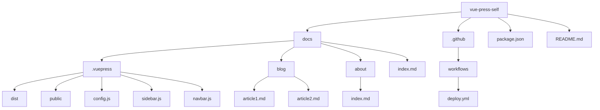

# VuePress博客项目技术架构与实施计划

## 1. VuePress版本与最佳实践分析

根据从VuePress官方网站获取的信息，VuePress强调简洁性、Vue驱动、性能优化、主题支持和插件系统。最新版本支持Vite作为推荐打包工具，同时也支持Webpack。最佳实践包括：
- 使用Markdown为中心的内容结构，专注于写作。
- 利用Vue组件在Markdown中增强内容。
- 通过预渲染静态HTML和单页应用(SPA)模式提升性能。
- 选择合适的主题和插件以扩展功能。

## 2. 项目目录结构设计

以下是建议的项目目录结构，旨在清晰地组织内容、配置和自定义元素：

```
/vue-press-self
|-- /docs
|   |-- /.vuepress
|   |   |-- /dist (构建输出目录)
|   |   |-- /public (静态资源目录)
|   |   |-- config.js (VuePress配置文件)
|   |   |-- sidebar.js (侧边栏配置)
|   |   |-- navbar.js (导航栏配置)
|   |-- /blog (博客文章目录)
|   |   |-- article1.md
|   |   |-- article2.md
|   |-- /about (关于页面)
|   |   |-- index.md
|   |-- index.md (首页)
|-- /.github
|   |-- /workflows
|       |-- deploy.yml (GitHub Actions部署配置文件)
|-- package.json (项目依赖和脚本)
|-- README.md (项目说明文件)
```

### 目录结构图 (Mermaid)



## 3. 配置文件与依赖项规划

### 主要依赖项
- **VuePress**: 核心框架，使用最新版本。
- **@vuepress/theme-default**: 官方默认主题。
- **vuepress-plugin-comment**: 用于实现评论系统（如Giscus或Utterances）。
- **vuepress-plugin-search**: 用于实现搜索功能。

### 配置文件
- **config.js**: 配置VuePress基本设置、主题和插件。
- **sidebar.js** 和 **navbar.js**: 配置导航结构。
- **package.json**: 定义项目依赖和构建脚本。

## 4. GitHub Pages部署策略

### 部署限制考虑
- GitHub Pages只托管静态文件，因此VuePress生成的静态HTML非常适合。
- 需要配置正确的`base`路径以适应GitHub Pages的URL结构。

### GitHub Actions工作流
使用GitHub Actions自动构建和部署到GitHub Pages：
1. 在`.github/workflows/deploy.yml`中定义工作流。
2. 工作流将在每次推送到`main`分支时触发，运行构建命令并将`dist`文件夹内容推送到`gh-pages`分支。

### 部署配置文件 (deploy.yml) 片段
```yaml
name: Deploy to GitHub Pages
on:
  push:
    branches: [ main ]
jobs:
  build-and-deploy:
    runs-on: ubuntu-latest
    steps:
    - uses: actions/checkout@v3
    - uses: actions/setup-node@v3
      with:
        node-version: '16'
    - run: npm install
    - run: npm run docs:build
    - uses: peaceiris/actions-gh-pages@v3
      with:
        github_token: ${{ secrets.GITHUB_TOKEN }}
        publish_dir: docs/.vuepress/dist
```

## 5. 实施步骤规划

1. **初始化项目**：
   - 创建项目目录并初始化Node.js项目（`npm init`）。
   - 安装VuePress及相关依赖。

2. **配置VuePress**：
   - 创建`docs`目录及`.vuepress/config.js`文件。
   - 配置主题为官方默认主题，并设置基础路径为GitHub Pages。

3. **添加内容**：
   - 在`docs`目录下创建博客文章和页面内容。
   - 配置侧边栏和导航栏。

4. **集成功能**：
   - 安装并配置评论系统插件（如Giscus）。
   - 安装并配置搜索功能插件。

5. **测试与构建**：
   - 本地运行VuePress进行预览（`npm run docs:dev`）。
   - 构建静态文件（`npm run docs:build`）。

6. **部署到GitHub Pages**：
   - 创建GitHub仓库并推送代码。
   - 配置GitHub Actions工作流进行自动部署。
   - 验证GitHub Pages站点是否正常运行。

## 6. 流程图 (Mermaid)

```mermaid
graph TD
    A[初始化项目] --> B[配置VuePress]
    B --> C[添加内容]
    C --> D[集成功能]
    D --> E[测试与构建]
    E --> F[部署到GitHub Pages]